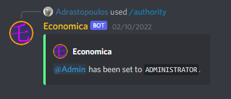
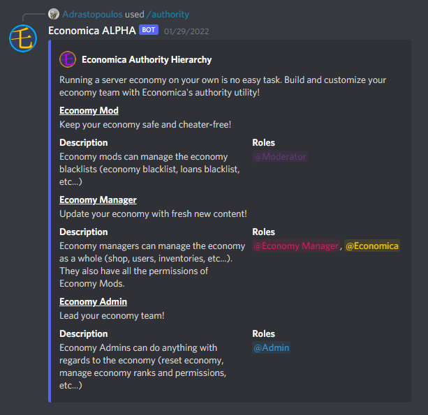
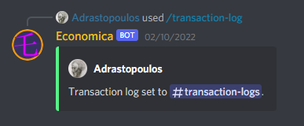

# Getting Started

Economica is highly configurable, which does come with the necessity of some configuration.

There are a couple things to set up and take note of in order to best use Economica.

## Authority

Commands have four distinct authority levels:

1. `Administrator` - Lead your economy team!
2. `Manager` - Economy managers can manage the economy as a whole
3. `Moderator` - Moderators can use moderation commands, and make changes to user balances
4. `User` - Default base permission

Each authority level corresponds to various permissions under command usage, and can be linked to a role with the `authority` command.

?> Members with `MANAGE_SERVER`, `ADMINISTRATOR`, and `GUILD_OWNER` permissions will have administrative authority.

You can also view the overall authority hierarchy with `authority view`.

 

## Logging

Economica provides a sophisticated logging system for transactions, infractions, and bot status.

You can set up transaction log with `transaction-log set <channel>`.

?> Bot status will inform of missing authorities and other useful debugging information. The cooldown is currently `10m`.

## Document Ids

Economica's database used an Id based system. For example: `620b1439ed810036441e815f`.

Ids are used in various commands for specifying transactions, infractions, loans, and much more.